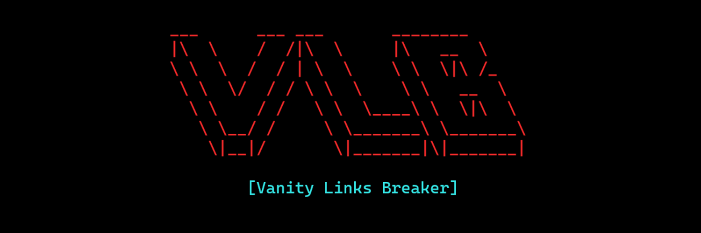

# 🔗 VLB

**VLB (Vanity Links Breaker)** is a CLI tool that allows you to track and log link redirects. It is a simple, user-friendly project where you only need to provide the target link.

> **❓ What's the purpose of this?**
>
> Visiting vanity links can sometimes lead to unexpected or potentially unsafe websites, which can be both frustrating and inappropriate. Our tool enhances your browsing safety by sending a HEAD request to the provided link, allowing you to verify the origin host before visiting the site.

### 💻 Usage

VLB is easy to use, making the process as simple as the following steps:

**► One-time run:**

If you want to process a single link, run the following command in the folder where the VLB program is located:

``` bash
VLB https://bit.ly/VLBexample
```

> Please replace the link `https://bit.ly/VLBexample` with your own.

**► Loop run:**

Open the terminal in the folder where the VLB program is located, and then run the following command:

``` bash
VLB
```

> **ⓘ NOTE:**
> You can run the program by double-clicking the file.

After that, paste your target link into the input, and the program will take care of the rest!

### ⚠️ Issues

If you encounter any issues, please open a [new issue](https://github.com/realyasser/VLB/issues) and provide a detailed description. This will help improving the software.

### 💻 Contribution

Contributions to this project are welcome, as long as the theme and purpose remain unchanged.
